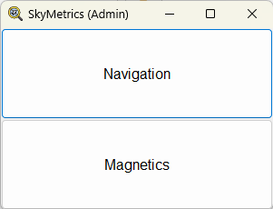
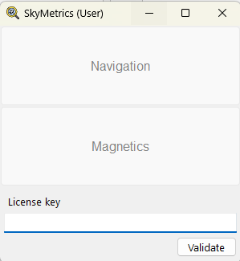
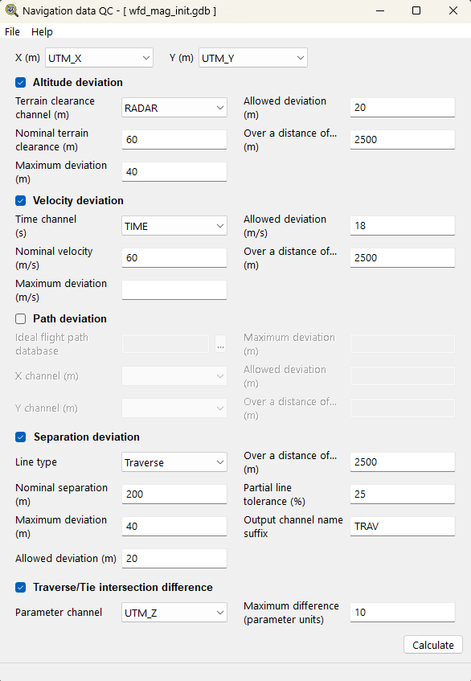
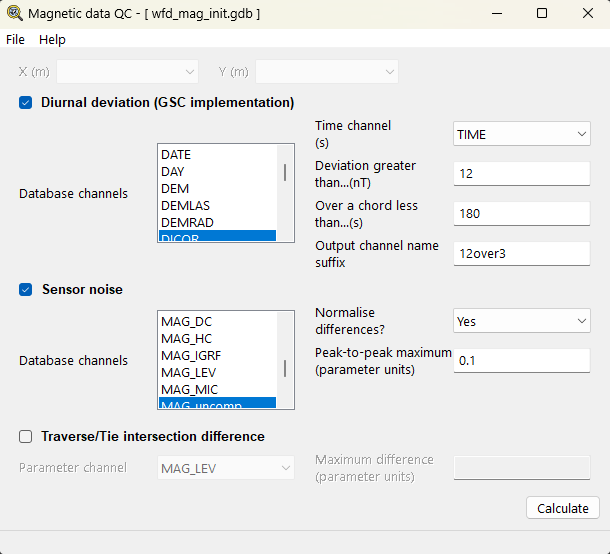

#  SkyMetrics

SkyMetrics is a desktop utility for running quality-control checks on airborne geophysical survey databases (Geosoft GDBs). It provides two modules:

- **Navigation data QC** for checks related to aircraft position (altitude, velocity, flight path deviation, line separation, and traverse/tie intersections)
- **Magnetic data QC** for checks related to magnetic sensors (base station deviations, sensor noise, and traverse/tie intersections)

The application is intended to make repeatable QC setup easier: open a survey database, select the relevant channels, enable the checks required for the project, enter the project tolerances, run the calculation.

## Libraries and Components

SkyMetrics is built as a Windows desktop application using a mixture of third-party SDKs, open-source libraries, and proprietary internal components.

- **wxWidgets** provides the desktop user interface, including the main launcher, module windows, menus, dialogue boxes, forms, buttons, channel selectors, file pickers, and validation controls(wxWindows Library Licence).
- **FluxAuth** is used by licence-enabled builds for application authentication and licence-key validation.
- **Geosoft GX Developer / Oasis montaj C++ APIs** provide access to Geosoft GDB files, database channels, line records, channel locking, reading, writing, and committing QC output back to the database (2-Clause BSD-style licence).
- **Eigen** is used in the geometry and line-separation components for vector and matrix operations (Mozilla Public Licence 2.0).
- **wxFormBuilder** was used during UI prototyping and layout generation for earlier interface definitions.
- **C++ standard library facilities** are used for file handling, formatting, filesystem paths, containers, execution utilities, and numeric processing.

SkyMetrics also includes proprietary internal components:

- **gdbkit** wraps Geosoft GDB access and contains the database-facing QC routines.
- **gpqc** contains lower-level geophysical QC calculations.
- **line_sep** contains line geometry and line-separation logic.
- **params** handles navigation and magnetic parameter loading, saving, and validation.

## Application Versions

SkyMetrics was written in separate Admin and User versions. The Admin version opens directly to the module launcher, while the User version presents licence-key validation before the QC modules are made available.

*Figure 1. SkyMetrics Admin main window, showing direct access to the Navigation and Magnetics modules.*

*Figure 2. SkyMetrics User main window, showing the licence-key validation step before module access.*

## Typical Workflow

1. Start SkyMetrics.
2. If the licensed build is being used, enter a valid license key when prompted. After validation, the key is stored locally in `license.lic`.
3. Choose one of the two modules from the launcher:
   - **Navigation** opens the navigation QC workflow.
   - **Magnetics** opens the magnetic QC workflow.
4. Use **File > Open GDB** to open the target Geosoft database.
5. After the database loads, SkyMetrics reads the available database channels and populates the channel selectors in the active module.
6. Select the X and Y coordinate channels where required.
7. Enable only the QC checks needed for the current deliverable.
8. Fill in the required channels, thresholds, tolerances, suffixes, and optional distance windows for the selected checks.
9. Optionally save the configuration as a parameter file so the same settings can be reused later.
10. Click **Calculate**.
11. Review the completion message and inspect the new or updated QC output channels in the GDB.

During calculation, the active controls are disabled to prevent accidental edits. If a validation or processing error occurs, SkyMetrics reports the issue and re-enables the workflow so the settings can be corrected.

## Navigation QC Workflow

The Navigation module works with position and navigation-related channels in a Geosoft GDB. It is opened from the main launcher by selecting **Navigation**.

Use **File > Open GDB** and select the survey `.gdb` file. Once loaded, the window title shows the active database name and the module controls become available.

*Figure 3. Navigation QC window showing coordinate channel selection, enabled QC checks, project tolerances, and the Calculate action.*

The module supports altitude deviation, velocity deviation, path deviation, line-separation deviation, and traverse/tie intersection checks. Each check can be enabled independently, so the user can configure only the QC tests required for a particular survey block or deliverable.

If one or more survey lines are not found in the ideal path database, SkyMetrics writes the missing line numbers to a `path_deviation.txt` file beside the active GDB and reports that in the completion message.

Navigation settings can be saved to a `.param_nav` file through **File > Save parameters** and later restored through **File > Load parameters**. This is useful when applying the same QC specification across multiple databases or survey blocks.

Click **Calculate** after all enabled checks are configured. SkyMetrics validates the required fields, runs the selected navigation QC routines, updates the database channel list, and displays a completion message.

## Magnetic QC Workflow

The Magnetics module works with magnetic channels in a Geosoft GDB. It is opened from the main launcher by selecting **Magnetics**.

Use **File > Open GDB** and select the survey `.gdb` file. SkyMetrics reads the database channels and enables the magnetic QC controls.

*Figure 4. Magnetic QC window showing diurnal deviation, sensor-noise settings, traverse/tie intersection controls, and the Calculate action.*

The module supports diurnal deviation checks, peak-to-peak sensor-noise checks, and traverse/tie intersection checks for selected magnetic or supporting parameter channels. Output channel suffixes are normalised by replacing spaces with underscores before channels are created.

Magnetic settings can be saved to a `.param_mag` file through **File > Save parameters** and later restored through **File > Load parameters**. Saved parameter files make it easier to keep magnetic QC thresholds consistent between processing sessions.

Click **Calculate** after all enabled checks are configured. SkyMetrics validates the selected fields, runs the selected magnetic QC routines, updates the database channel list, and displays a completion message.

## Parameter Files

SkyMetrics supports separate parameter-file formats for each module:

- `.param_nav` for Navigation QC.
- `.param_mag` for Magnetic QC.

Parameter files store the enabled checks and their configured channels, thresholds, tolerances, suffixes, and supporting inputs. They are intended for operational repeatability, especially when the same QC specification must be applied to more than one database.

## Proprietary Notice

SkyMetrics was written while the author was employed as a Senior Geophysicist at a geophysical consultancy.

The SkyMetrics source code, build artefacts, algorithms, and implementation details are proprietary and confidential. No licence is granted for public redistribution, reuse, reverse engineering, or sharing outside authorised parties.

This repository is maintained only for limited public-facing project material, such as this README and approved screenshots. The application code and internal assets are intentionally excluded from version control.
